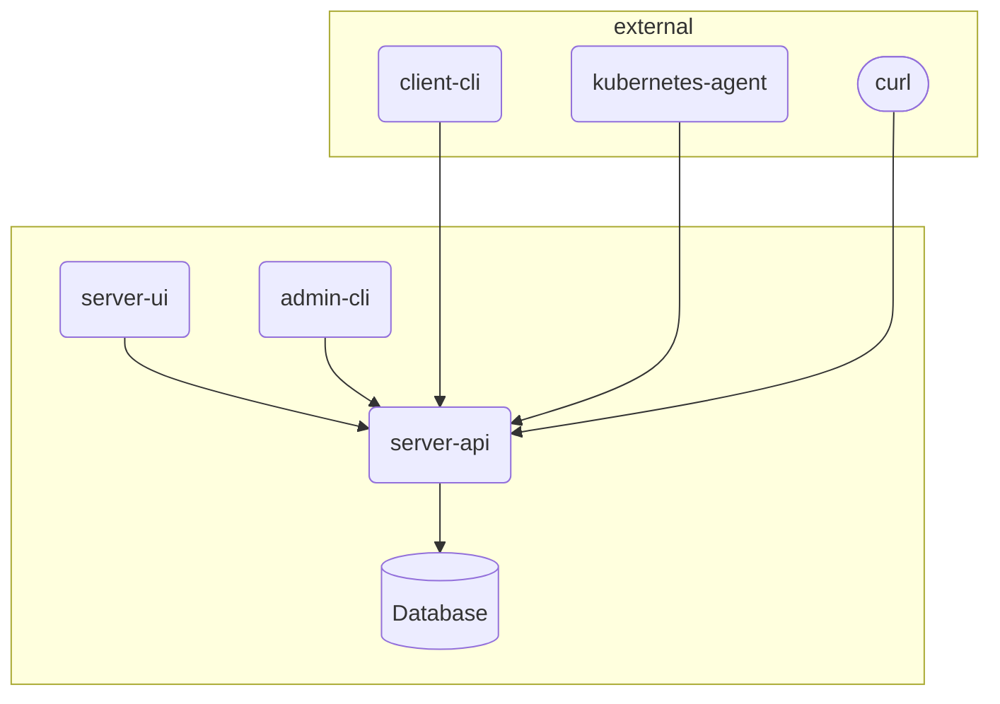

# Ledger

[](https://github.com/stenic/ledger/actions/workflows/release.yaml)
[](https://artifacthub.io/packages/helm/ledger/ledger)

> Ledger allows you to record versions of applications you manage. It gives insights in your team's
> deployment habits.



## Installation

```bash
helm repo add ledger https://stenic.github.io/ledger/
helm install ledger --namespace ledger ledger/ledger
```

## Collecting versions

Ledger lets you choose how you want te record versions.

- **client-cli**: Included cli tool `ledger client -h`
- **kubernetes-agent**: Included kubernetes agent `ledger agent -h`
- **curl**: Send without ledger on your system

### Client-cli

```bash
curl -o ledger https://[ledger-installation]/download
chmod +x ledger
./ledger client new-version app env version
```

### Kubernetes agent

It will collect changes to Deployments and Statefulsets

### Sending using the GraphQL API

```bash
export TOKEN=ey...

export version=1.2.3

curl 'https://ledger.development.tbnlabs.be/query' \
 -H "authorization: Bearer $TOKEN" \
  -H 'content-type: application/json' \
  --data-raw "{\"query\":\"mutation { createVersion( input: { application:\\\"$version\\\", environment:\\\"test\\\", version:\\\"$version\\\" } ) { id } }\"}" \
 --compressed \
 --insecure
```

## Administration

```
kubectl exec -ti svc/ledger-server /app/ledger admin new-token agent
```
